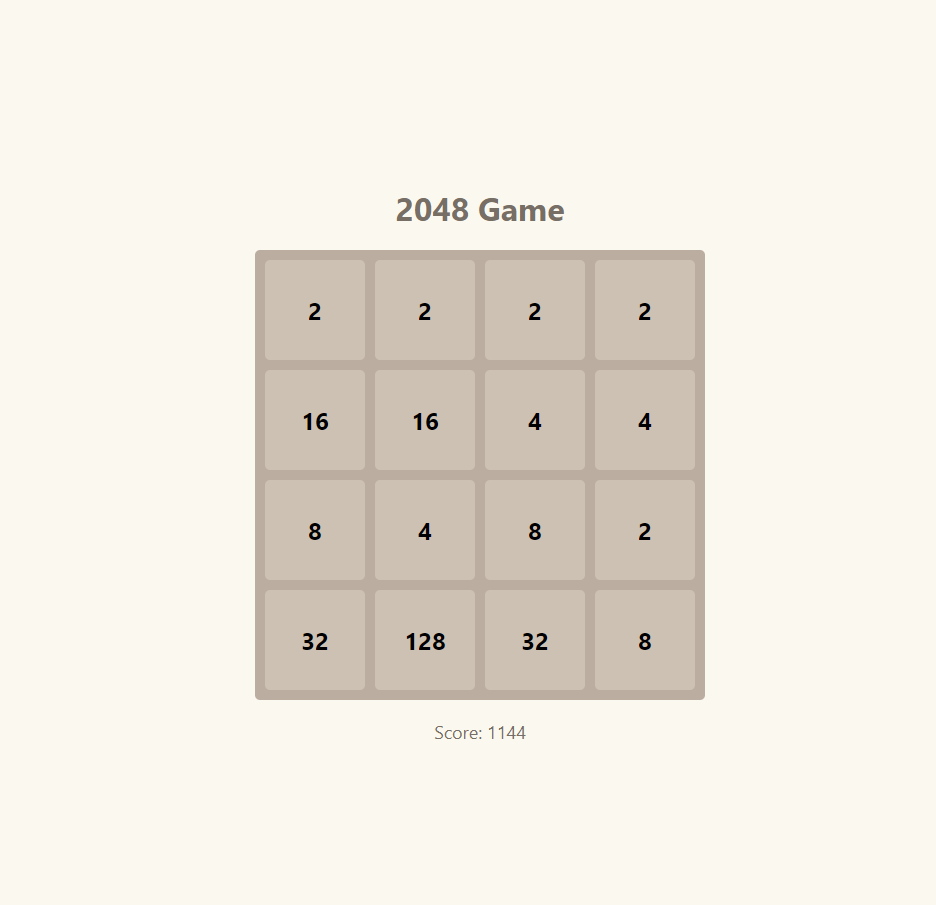

---

# 2048 Game

A web-based version of the classic **2048 puzzle game** built using **HTML**, **CSS**, and **JavaScript**. Combine tiles with the same numbers to reach the **2048 tile**. Challenge yourself to reach the highest score!



## 🚀 Live Demo

You can try the game [here](https://limitlessprogrammer.github.io/2048/)

## 🕹️ How to Play
- Use the **arrow keys** to move the tiles.
- Tiles with the same number **merge** when they collide.
- The goal is to create the tile with the number **2048**.
- The game ends when there are no more possible moves.

## 🛠️ Built With

- **HTML5** - Game structure
- **CSS3** - Styling and tile animations
- **JavaScript** - Game logic and interaction

## 🎮 Features

- Smooth tile animations and transitions
- Dynamic score tracking
- Restart button to reset the game anytime
- Sound effects for tile merging and game over (optional)

## 📂 Project Structure

```
2048-game/
│
├── index.html        # The main HTML file
├── styles.css        # CSS styles for the game board and tiles
├── script.js         # JavaScript logic for game mechanics
├── merge.mp4         # Sound effect for tile merge
└── game-over.mp4     # Sound effect for game over
```

## 💻 Setup

1. Clone the repository:

   ```bash
   git clone https://github.com/your-username/2048.git
   cd 2048
   ```

2. Open `index.html` in your web browser to start the game.

## 🎥 YouTube Walkthrough

Watch a full walkthrough of how this game was built on my YouTube channel, [Limitless Programmer](https://www.youtube.com/@LimitlessProgrammer).

## 🔧 Future Improvements

- Add an **undo** button to reverse the last move.
- Implement a **high score** system.
- Add more advanced **animations** for tile merging.


